# Deploying NGINX Web Application on Amazon EKS

## 📌 Project Overview

This project demonstrates how to deploy a simple **NGINX web application on Amazon Elastic Kubernetes Service (EKS)**.

The project was created using an EC2 management server with `kubectl`, `eksctl`, and AWS CLI. An EKS cluster was created with two worker nodes, and the NGINX application was deployed using Kubernetes Deployment and Service resources.

The application was exposed to the internet using an AWS Load Balancer.

### Architecture

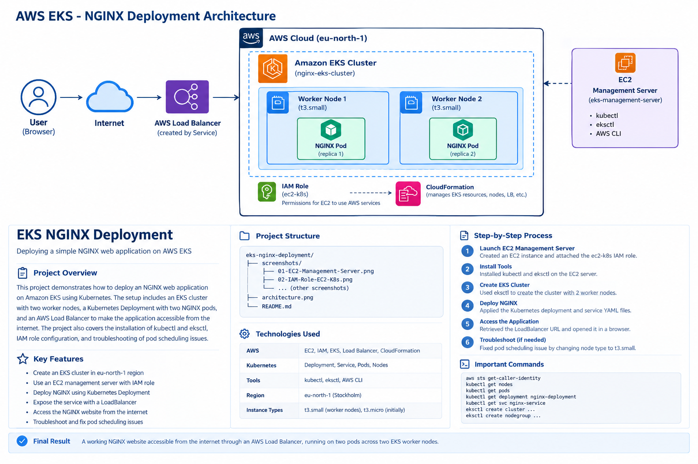

---

## 🛠️ Technologies Used

* **AWS EC2** – Management server
* **Amazon EKS** – Managed Kubernetes cluster
* **Amazon EC2** – EKS worker nodes
* **AWS IAM** – Permissions and IAM role
* **AWS CloudFormation** – Infrastructure management through eksctl
* **Kubernetes** – Container orchestration
* **NGINX** – Web server
* **kubectl** – Kubernetes command-line tool
* **eksctl** – EKS cluster management tool
* **AWS CLI** – AWS resource management
* **Linux** – Operating system/environment

---

## ☁️ AWS Region

**Region:** `eu-north-1` (Europe – Stockholm)

---

## 🏗️ Project Architecture

The project follows this flow:

```text
User Browser
     │
     ▼
  Internet
     │
     ▼
AWS Load Balancer
     │
     ▼
Kubernetes Service
     │
     ▼
Amazon EKS Cluster
     │
     ├── Worker Node 1
     │       └── NGINX Pod
     │
     └── Worker Node 2
             └── NGINX Pod
```

The NGINX application was configured with **2 replicas**, allowing the application to run on two Kubernetes pods.

---

# 🚀 Project Implementation

## 1. Create EC2 Management Server

An Amazon Linux EC2 instance was created to act as the management server for the Kubernetes environment.

### EC2 Configuration

* Instance Name: `eks-management-server`
* Instance Type: `t3.micro`
* Operating System: Amazon Linux 2023
* Region: `eu-north-1`

The management server was used to install and run:

* AWS CLI
* kubectl
* eksctl

---

## 2. Configure IAM Role

An IAM role was attached to the EC2 management server so that AWS CLI and eksctl could communicate with AWS services without storing access keys on the server.

### IAM Role

```text
ec2-k8s
```

The role was attached to the EC2 instance through an IAM instance profile.

---

## 3. Verify AWS Identity

The AWS identity associated with the EC2 instance was verified using:

```bash
aws sts get-caller-identity
```

This confirmed that the EC2 instance was using the expected IAM role.

---

## 4. Install kubectl

`kubectl` was installed on the EC2 management server.

The installed version was verified using:

```bash
kubectl version --client
```

---

## 5. Install eksctl

`eksctl` was installed to simplify the creation and management of the EKS cluster.

Version was checked using:

```bash
eksctl version
```

---

## 6. Configure AWS Region

The project was created in the Stockholm region:

```bash
export AWS_REGION=eu-north-1
export AWS_DEFAULT_REGION=eu-north-1
```

The available EKS clusters were checked using:

```bash
eksctl get clusters --region eu-north-1
```

---

# ☸️ 7. Create EKS Cluster

The EKS cluster was created using `eksctl`.

```bash
eksctl create cluster \
  --name nginx-eks-cluster \
  --region eu-north-1 \
  --nodegroup-name nginx-worker-nodes \
  --node-type t3.micro \
  --nodes 2 \
  --nodes-min 2 \
  --nodes-max 2
```

### Cluster Name

```text
nginx-eks-cluster
```

Initially, two `t3.micro` worker nodes were created.

---

# 🔧 8. Troubleshooting Worker Nodes

After creating the cluster, the worker nodes were checked using:

```bash
kubectl get nodes
```

The nodes were in the `Ready` state.

However, when the NGINX deployment was created, the pods remained in the `Pending` state.

The pod events were checked using:

```bash
kubectl describe pod <pod-name>
```

The following scheduling issue was identified:

```text
Too many pods
```

This occurred because the initial `t3.micro` worker nodes had limited resources/pod capacity for the required Kubernetes workloads.

### Solution

The initial node group was removed and recreated using `t3.small` instances.

```bash
eksctl create nodegroup \
  --cluster nginx-eks-cluster \
  --name nginx-worker-nodes \
  --region eu-north-1 \
  --node-type t3.small \
  --nodes 2 \
  --nodes-min 2 \
  --nodes-max 2
```

After the new worker nodes were created:

```bash
kubectl get nodes
```

Both nodes showed the `Ready` status.

This troubleshooting step helped demonstrate how Kubernetes scheduling and node capacity affect application deployment.

---

# 🐳 9. Create NGINX Deployment

A Kubernetes Deployment was created in `deployment.yaml`.

```yaml
apiVersion: apps/v1
kind: Deployment
metadata:
  name: nginx-deployment
spec:
  replicas: 2
  selector:
    matchLabels:
      app: nginx
  template:
    metadata:
      labels:
        app: nginx
    spec:
      containers:
      - name: nginx
        image: nginx
        ports:
        - containerPort: 80
```

The deployment was created using:

```bash
kubectl apply -f deployment.yaml
```

The deployment was checked using:

```bash
kubectl get deployment nginx-deployment
```

---

# 🌐 10. Create Kubernetes Service

A Kubernetes Service was created to expose the NGINX application.

File:

```text
service.yaml
```

Configuration:

```yaml
apiVersion: v1
kind: Service
metadata:
  name: nginx-service
spec:
  type: LoadBalancer
  selector:
    app: nginx
  ports:
  - port: 80
    targetPort: 80
```

The service was created using:

```bash
kubectl apply -f service.yaml
```

---

# ⚖️ 11. AWS Load Balancer

Because the Kubernetes Service was configured as:

```yaml
type: LoadBalancer
```

AWS automatically provisioned a Load Balancer for the service.

The Load Balancer endpoint was obtained using:

```bash
kubectl get svc nginx-service
```

The service exposed port:

```text
80
```

The Load Balancer endpoint was opened in a web browser.

---

# 🌍 12. Verify NGINX Application

The running pods were checked using:

```bash
kubectl get pods
```

The final deployment had:

```text
2 NGINX pods
```

Both pods reached the `Running` state.

The application was then accessed through the AWS Load Balancer URL.

The default NGINX welcome page was successfully displayed in the browser.

---

# 📁 Project Structure

```text
eks-nginx-deployment/
│
├── screenshots/
│   ├── 01-EC2-Management-Server.png
│   ├── 02-IAM-Role-EC2-K8s.png
│   ├── 03-AWS-IAM-Verification.png
│   ├── 04-kubectl-Version.png
│   ├── 05-eksctl-Version.png
│   ├── 06-AWS-Region-Cluster-Check.png
│   ├── 07-EKS-Nodes.png
│   ├── 08-NGINX-Deployment.png
│   ├── 09-NGINX-Service.png
│   ├── 10-EKS-Nodes-Ready.png
│   ├── 11-NGINX-Pods.png
│   └── 12-NGINX-Website.png
│
├── architecture.png
├── deployment.yaml
├── service.yaml
└── README.md
```

---

# 📸 Screenshots

### EC2 Management Server

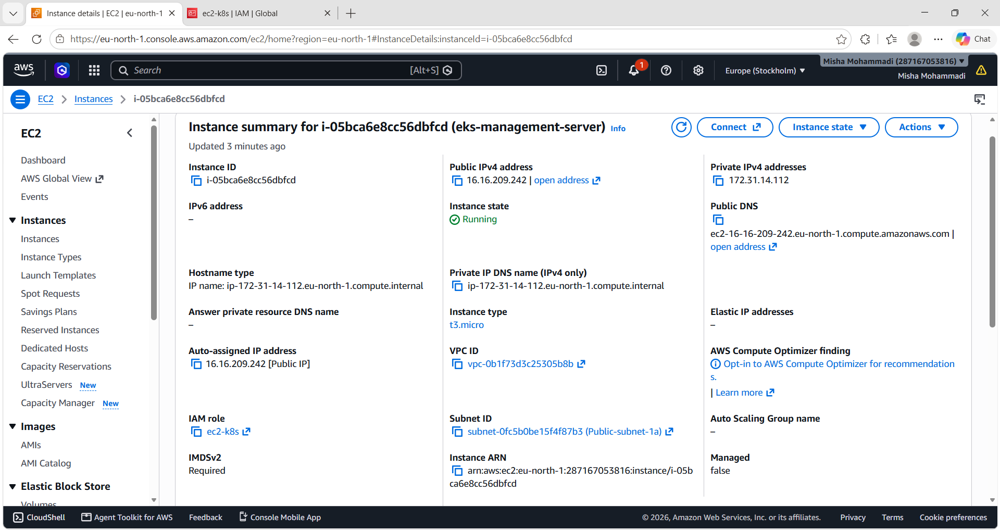

### IAM Role

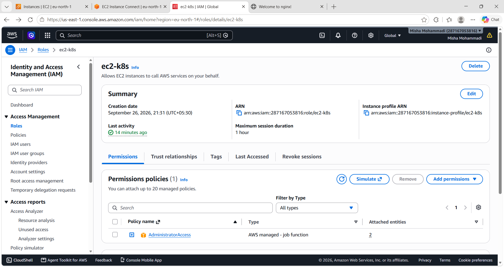

### AWS IAM Verification


### kubectl Version

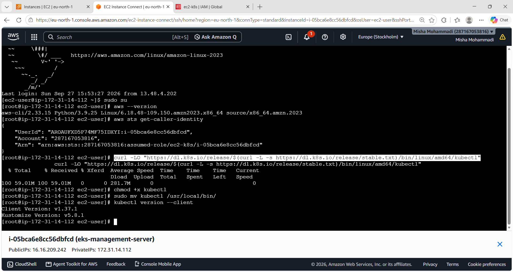

### eksctl Version

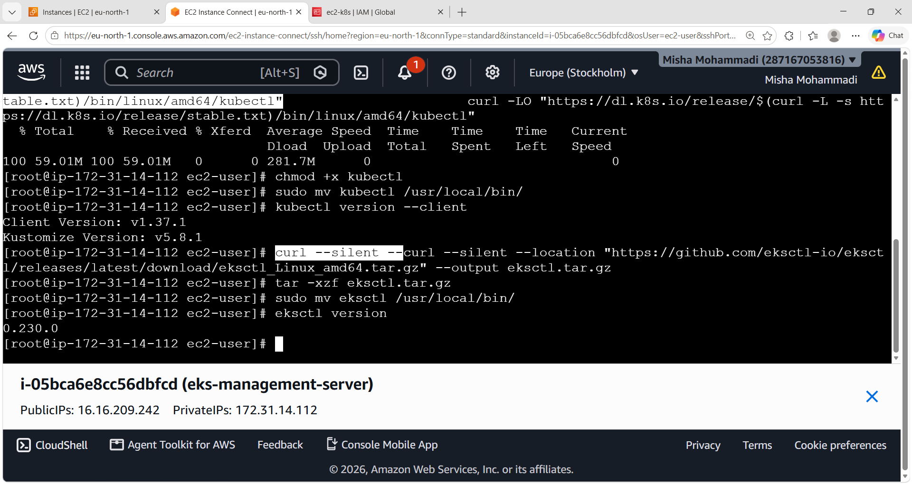

### AWS Region and Cluster Check

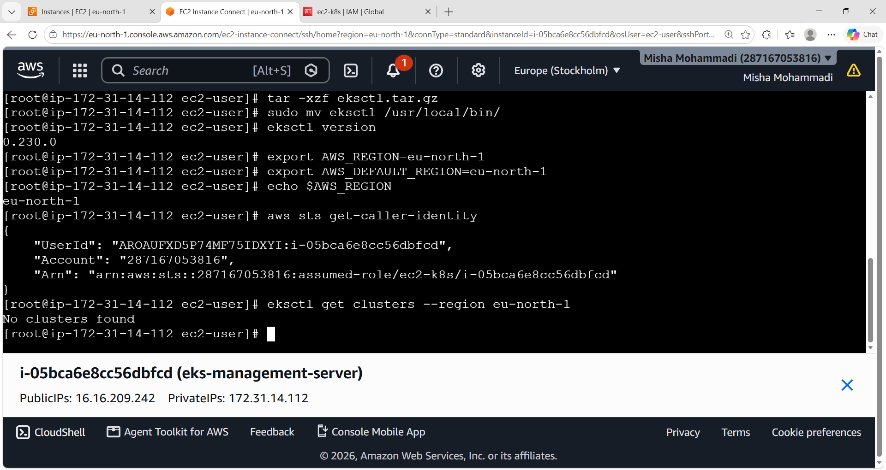

### EKS Nodes

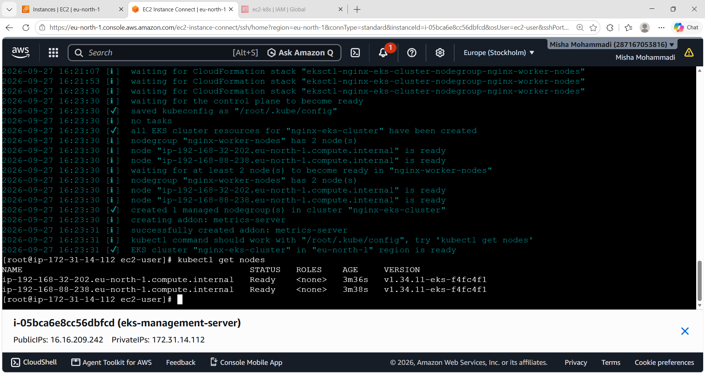

### NGINX Deployment

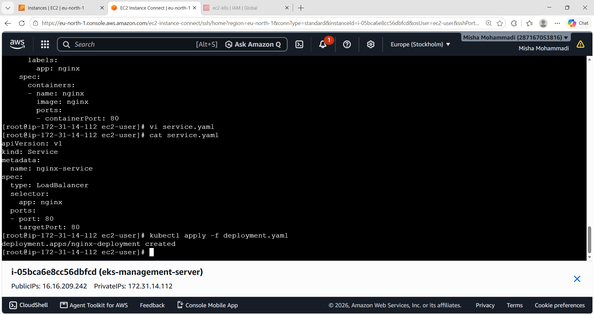

### NGINX Service

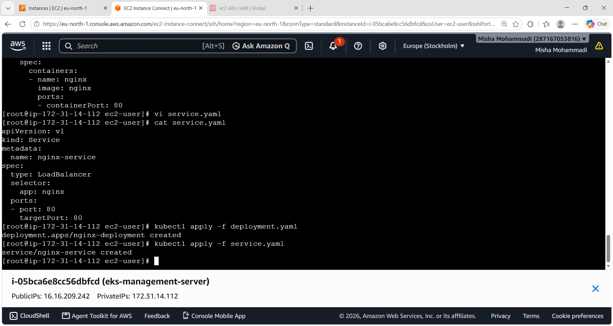

### EKS Nodes Ready

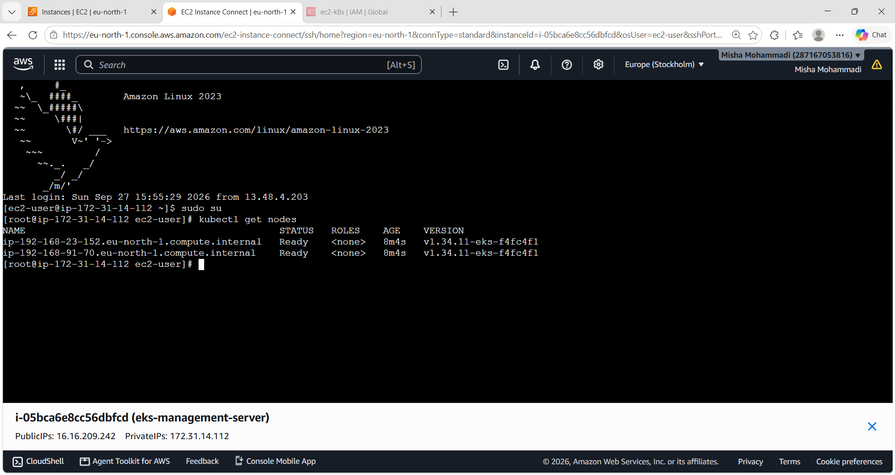

### NGINX Pods

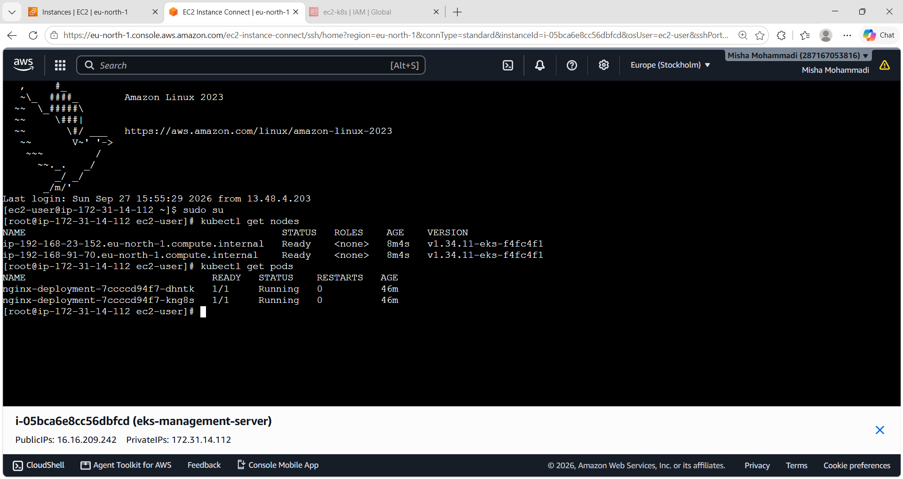

### NGINX Website

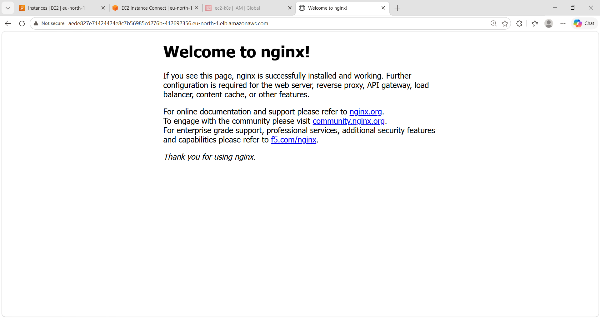

---

# 🔑 Important Commands

### Check AWS identity

```bash
aws sts get-caller-identity
```

### Check EKS clusters

```bash
eksctl get clusters --region eu-north-1
```

### Check Kubernetes nodes

```bash
kubectl get nodes
```

### Check pods

```bash
kubectl get pods
```

### Check deployment

```bash
kubectl get deployment
```

### Check services

```bash
kubectl get svc
```

### Describe a pod

```bash
kubectl describe pod <pod-name>
```

### Apply deployment

```bash
kubectl apply -f deployment.yaml
```

### Apply service

```bash
kubectl apply -f service.yaml
```

---

# 🧹 Cleanup

After completing the project and taking the required screenshots, the EKS resources were cleaned up to avoid unnecessary AWS charges.

The cluster can be deleted using:

```bash
eksctl delete cluster \
  --name nginx-eks-cluster \
  --region eu-north-1
```

The management EC2 instance and associated IAM resources can also be removed after the project is completed.

---

# 📚 What I Learned

Through this project, I learned:

* How Amazon EKS works with Kubernetes
* How to create an EKS cluster using `eksctl`
* How EC2 can be used as a Kubernetes management server
* How IAM roles provide AWS permissions to EC2
* How to use `kubectl` to manage Kubernetes resources
* How Kubernetes Deployments manage application replicas
* How Kubernetes Services expose applications
* How `LoadBalancer` services integrate with AWS
* How Kubernetes schedules pods onto worker nodes
* How limited node resources can cause pods to remain in `Pending`
* How to troubleshoot Kubernetes scheduling problems
* How to scale the worker-node instance type to support workloads
* How EKS infrastructure is managed using AWS services and CloudFormation

---

# 🎯 Final Result

The NGINX web application was successfully deployed on an Amazon EKS cluster with **two worker nodes and two NGINX pod replicas**.

The application was exposed through a Kubernetes `LoadBalancer` Service and successfully accessed from a web browser through the AWS Load Balancer.

```text
Browser
   ↓
Internet
   ↓
AWS Load Balancer
   ↓
Kubernetes Service
   ↓
NGINX Pods
   ↓
EKS Worker Nodes
```

## Project Status

**Completed ✅**

**AWS EKS | Kubernetes | NGINX | EC2 | IAM | Load Balancer | Linux | kubectl | eksctl**
